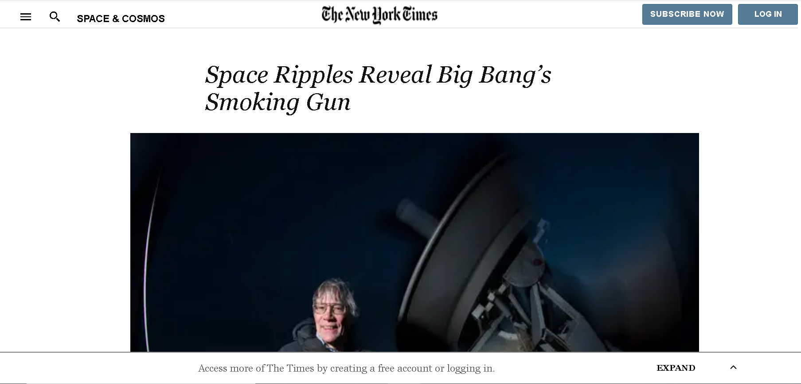

# NewYork-Times-Page
# The-New-York-Times-Page

### **Description:** 

Project based The New York Times page, it shows a Subscribe Now and Log In button on the top-right corner, a main section related to news and a footer section.
 
 **Header (Subscribe section):**
 
 	- A link to another URL (if user wants to subscribe  or Log In).
 	- A button for Subscribe Now and Log In.
 	
 **Main section:**
 
 	- Embedded images , data and  different URLs for further information.
 	- A Grid applied with background image to make information more attractive.
 	- A concept of Flex container with Grid container inside.
 	
 **Footer section:**
 
 	- Defining about the different sections of news.
 	- Text related to legal information about the website.
 	
	
 ### **Tools used:**
 
 HTML5, and CSS3.
 
 
 
  [Live demo link](https://ultramax.github.io/HTML-Forms/)
 
 
### **Getting Started:**

The New York Times Page including a Header, Main, and Footer sections.

 ### **Requirements:** 

 - OS: Windows, Linux, or Mac.
 - Browser: Google Chrome, Mozilla Firefox, Edge, etc.
 

### **Set up:**

You can download the code or clone the repository to your local system.

## **Author:**

👤 Varun Sharma

GitHub: [@Varun2323](https://github.com/Varun2323)

LinkedIn: [Varun Sharma](https://www.linkedin.com/in/varun-sharma-82b29b82/)

 
## **Show your support**

Spread the word if you like this project.

## **Acknowledgments**

Thanks to - [W3Schools](http://w3schools-fa.ir)

Thanks to - [stack overflow](https://stackoverflow.com/)

